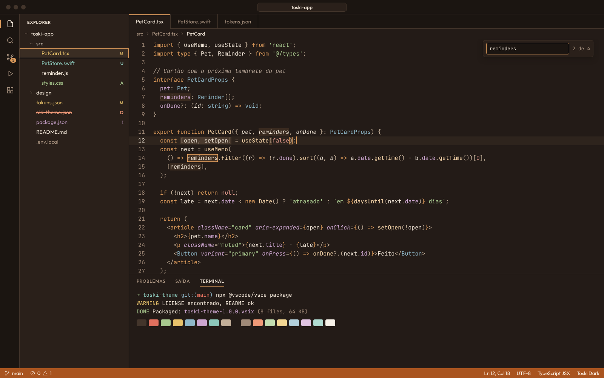
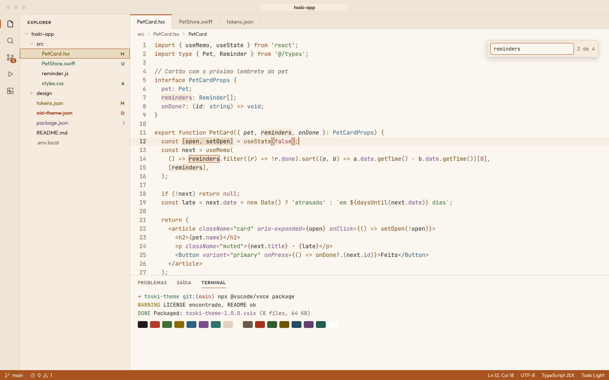
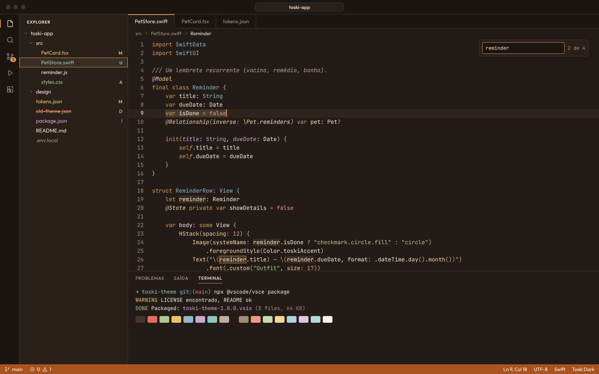
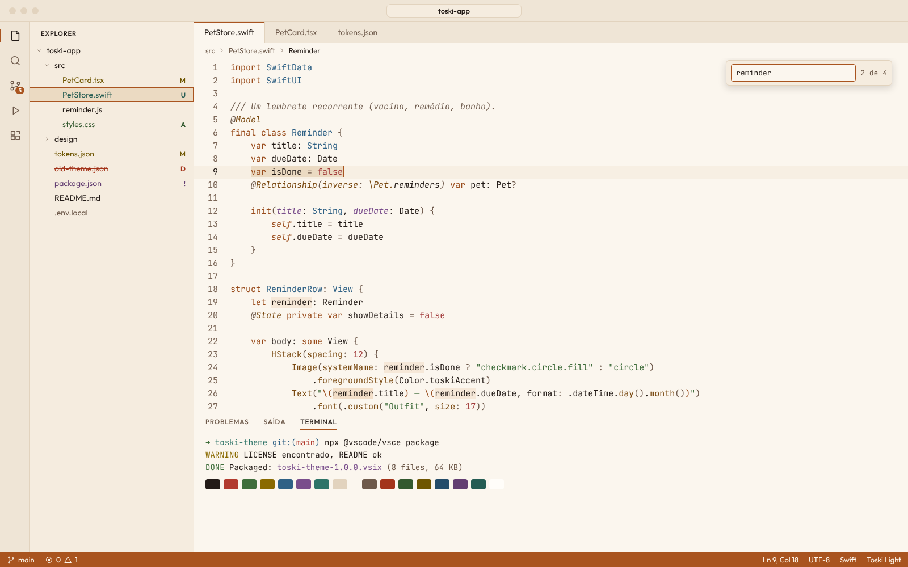
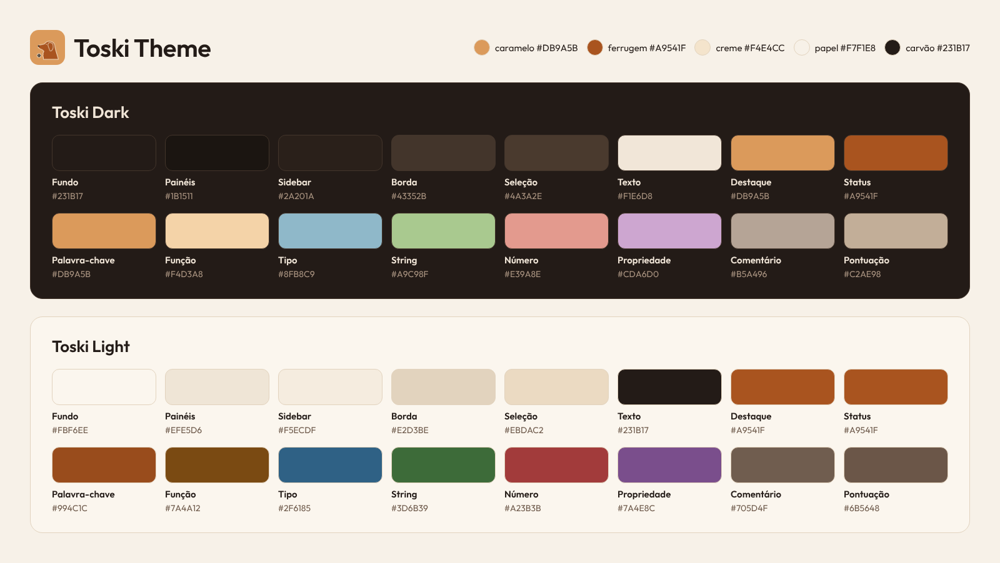

<p align="center">
  
</p>

<h1 align="center">Toski Theme</h1>

<p align="center">
  <b>Toski Dark</b> e <b>Toski Light</b> para o VS Code, com as cores da <a href="https://toski-labs.web.app">Toski Labs</a>.<br>
  <a href="#português">Português</a> · <a href="#english">English</a>
</p>





---

## Português

O Toski é um tema quente, em tons de caramelo, ferrugem, creme e carvão. Ele nasceu da identidade visual da Toski Labs, que foi inspirada na Paçoca, a golden retriever que é a CEO do laboratório.

- **Toski Dark**: fundo carvão (`#231B17`) e destaque caramelo (`#DB9A5B`).
- **Toski Light**: fundo papel (`#FBF6EE`) e destaque ferrugem (`#A9541F`).
- Todo texto de código e de interface tem contraste de pelo menos **4,5:1** onde aparece, inclusive sobre a linha atual, a seleção, os resultados de busca, o diff e as listas.
- O terminal usa as mesmas cores ANSI do [tema Toski para iTerm2](https://github.com/Toski-Labs/toski-labs-iterm-theme).
- Feito para TypeScript/JavaScript, TSX/JSX, Swift, JSON, Markdown, CSS/SCSS, HTML, YAML e shell. O destaque semântico vem ativado.

### Instalação

**Marketplace do VS Code**

1. Abra a aba **Extensões** (`⇧⌘X` no Mac, `Ctrl+Shift+X` no Windows/Linux).
2. Procure **Toski Theme** e clique em **Install**.
3. Abra `⌘K ⌘T` (ou `Ctrl+K Ctrl+T`) e escolha **Toski Dark** ou **Toski Light**.

Ou pela página do [Marketplace](https://marketplace.visualstudio.com/items?itemName=toskilabs.toski-theme).

**Open VSX** (VSCodium, Cursor, Windsurf, Gitpod…)

Procure **Toski Theme** na aba de extensões do editor, ou abra a página no [Open VSX](https://open-vsx.org/extension/toskilabs/toski-theme).

**Linha de comando**

```bash
code --install-extension toskilabs.toski-theme
```

### Trocar sozinho com o tema do sistema

Para o VS Code usar o Toski Light de dia e o Toski Dark à noite, junto com o macOS ou o Windows, adicione isto ao `settings.json`:

```json
"window.autoDetectColorScheme": true,
"workbench.preferredLightColorTheme": "Toski Light",
"workbench.preferredDarkColorTheme": "Toski Dark"
```

### Swift





### Paleta



| Papel | Toski Dark | Toski Light |
|---|---|---|
| Fundo do editor | `#231B17` | `#FBF6EE` |
| Painéis (activity bar, abas inativas, títulos) | `#1B1511` | `#EFE5D6` |
| Sidebar | `#2A201A` | `#F5ECDF` |
| Bordas | `#43352B` | `#E2D3BE` |
| Texto | `#F1E6D8` | `#231B17` |
| Texto secundário | `#AA9481` | `#6E5A4B` |
| Números de linha | `#A08A78` | `#7A6556` |
| Destaque | `#DB9A5B` | `#A9541F` |
| Barra de status | `#A9541F` / `#FFF8EE` | `#A9541F` / `#FFF8EE` |
| Linha atual | `#2E241D` | `#F7EFE3` |
| Item ativo da lista | `#3A2D23` | `#EBDAC2` |
| Seleção | `#4A3A2E` | `#EBDAC2` |
| Cursor | `#DB9A5B` | `#A9541F` |

**Sintaxe**

| Token | Toski Dark | Toski Light |
|---|---|---|
| Palavra-chave | `#DB9A5B` | `#994C1C` |
| Função | `#F4D3A8` | `#7A4A12` |
| Tipo / classe | `#8FB8C9` | `#2F6185` |
| String | `#A9C98F` | `#3D6B39` |
| Número / constante | `#E39A8E` | `#A23B3B` |
| Propriedade / atributo | `#CDA6D0` | `#7A4E8C` |
| Comentário (itálico) | `#B5A496` | `#705D4F` |
| Pontuação / operador | `#C2AE98` | `#6B5648` |
| Variável | `#F1E6D8` | `#231B17` |

**Terminal (ANSI, igual ao iTerm2)**

| # | Cor | Toski Dark | Toski Light | # | Cor (bright) | Toski Dark | Toski Light |
|---|---|---|---|---|---|---|---|
| 0 | Preto | `#43352B` | `#231B17` | 8 | Preto | `#A08A78` | `#6E5A4B` |
| 1 | Vermelho | `#E0705E` | `#B23A2E` | 9 | Vermelho | `#F09A78` | `#A3341A` |
| 2 | Verde | `#A9C98F` | `#3F6E3B` | 10 | Verde | `#C2DDB0` | `#33592F` |
| 3 | Amarelo | `#E8C26B` | `#8A6A00` | 11 | Amarelo | `#F2D693` | `#6E5500` |
| 4 | Azul | `#8FB8C9` | `#2F6185` | 12 | Azul | `#B3D0DC` | `#244C69` |
| 5 | Magenta | `#CDA6D0` | `#7A4E8C` | 13 | Magenta | `#E0C4E2` | `#633E72` |
| 6 | Ciano | `#8CC7BA` | `#2E7468` | 14 | Ciano | `#B0DBD1` | `#245C53` |
| 7 | Branco | `#C2AE98` | `#E2D3BE` | 15 | Branco | `#F7F1E8` | `#FFFDF9` |

### Mais da Toski Labs

Temas para iTerm2, wallpapers e outras coisas: [toski-labs.web.app/estudio/temas](https://toski-labs.web.app/estudio/temas).

Achou um problema ou tem uma ideia? [Abra uma issue](https://github.com/Toski-Labs/toski-labs-vscode-theme/issues/new).

---

## English

Toski is a warm theme in caramel, rust, cream and charcoal. It comes from the Toski Labs visual identity, which was inspired by Paçoca, the golden retriever who is the lab's CEO.

- **Toski Dark**: charcoal background (`#231B17`) with a caramel accent (`#DB9A5B`).
- **Toski Light**: paper background (`#FBF6EE`) with a rust accent (`#A9541F`).
- All code and UI text has a contrast of at least **4.5:1** wherever it appears, including on the current line, the selection, search results, diffs and lists.
- The terminal uses the same ANSI colors as the [Toski theme for iTerm2](https://github.com/Toski-Labs/toski-labs-iterm-theme).
- Made for TypeScript/JavaScript, TSX/JSX, Swift, JSON, Markdown, CSS/SCSS, HTML, YAML and shell. Semantic highlighting is on.

### Install

**VS Code Marketplace**

1. Open the **Extensions** view (`⇧⌘X` on Mac, `Ctrl+Shift+X` on Windows/Linux).
2. Search for **Toski Theme** and click **Install**.
3. Press `⌘K ⌘T` (or `Ctrl+K Ctrl+T`) and pick **Toski Dark** or **Toski Light**.

Or use the [Marketplace page](https://marketplace.visualstudio.com/items?itemName=toskilabs.toski-theme).

**Open VSX** (VSCodium, Cursor, Windsurf, Gitpod…)

Search for **Toski Theme** in your editor's Extensions view, or open the [Open VSX page](https://open-vsx.org/extension/toskilabs/toski-theme).

**Command line**

```bash
code --install-extension toskilabs.toski-theme
```

### Follow the system appearance

To use Toski Light by day and Toski Dark at night, following macOS or Windows, add this to your `settings.json`:

```json
"window.autoDetectColorScheme": true,
"workbench.preferredLightColorTheme": "Toski Light",
"workbench.preferredDarkColorTheme": "Toski Dark"
```

### Palette

The tables in the Portuguese section above list every color. In English:

| Role | Toski Dark | Toski Light |
|---|---|---|
| Editor background | `#231B17` | `#FBF6EE` |
| Text | `#F1E6D8` | `#231B17` |
| Accent | `#DB9A5B` | `#A9541F` |
| Keyword | `#DB9A5B` | `#994C1C` |
| Function | `#F4D3A8` | `#7A4A12` |
| Type / class | `#8FB8C9` | `#2F6185` |
| String | `#A9C98F` | `#3D6B39` |
| Number / constant | `#E39A8E` | `#A23B3B` |
| Property / attribute | `#CDA6D0` | `#7A4E8C` |
| Comment (italic) | `#B5A496` | `#705D4F` |
| Punctuation / operator | `#C2AE98` | `#6B5648` |

### More from Toski Labs

iTerm2 themes, wallpapers and more: [toski-labs.web.app/estudio/temas](https://toski-labs.web.app/estudio/temas).

Found a bug or have an idea? [Open an issue](https://github.com/Toski-Labs/toski-labs-vscode-theme/issues/new).

---

## Créditos / Credits

A estrutura do pacote seguiu como referência o [Unified Glow](https://github.com/IkramHussainSiyam/unified-glow-vscode-theme), de Ikram Hussain Siyam (MIT). As cores são todas da Toski Labs. / The package layout followed [Unified Glow](https://github.com/IkramHussainSiyam/unified-glow-vscode-theme) by Ikram Hussain Siyam (MIT) as a reference. All colors are Toski Labs' own.

## Licença / License

[MIT](LICENSE) © 2026 Toski Labs
